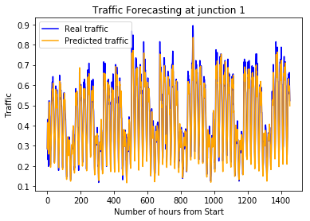
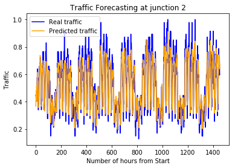
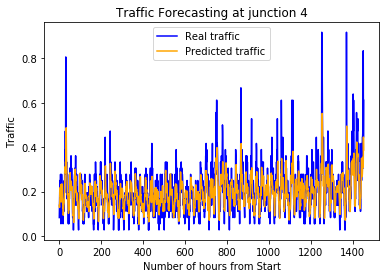

Megatrons Urban Traffic Analysis	
Analyze and visualize urban traffic patterns during peak hours.

# Problem statement

Context & Overview:
Urban areas around the world are experiencing rapid population growth, leading to increased traffic congestion during peak hours. This congestion negatively impacts transportation efficiency, public safety, economic activity, and environmental sustainability. In many cities, peak hours are characterized by a higher concentration of vehicles on roads, leading to bottlenecks, delays, and air pollution. However, a detailed understanding of traffic patterns during these peak hours can provide valuable insights for optimizing traffic management, infrastructure development, and urban planning.
Objective:
The primary objective of this project is to analyze and visualize urban traffic patterns during peak hours in order to identify key trends, predict traffic flow, and propose actionable solutions to reduce congestion and improve overall traffic efficiency. The team, "Megatrons," will focus on understanding the underlying causes of traffic jams, modeling peak-hour traffic behavior, and presenting data-driven insights that can inform policy decisions, traffic management strategies, and infrastructure investments.
**Your task:** To predict traffic patterns in each of these four junctions for the next 4 months.

**Data:** The sensors on each of these junctions were collecting data at different times,
hence you will see traffic data from different time periods.
To add to the complexity, some of the junctions have provided limited or sparse data requiring thoughtfulness
when creating future projections. Depending upon the historical data of 20 months,
the government is looking to you to deliver accurate traffic projections for the coming four months.
Your algorithm will become the foundation of a larger transformation to make your city smart and intelligent.

The evaluation metric for the competition is RMSE. Public-Private split for the competition is 25:75.


We have 48120 point of training data (data **each hour** from 2015-11-01 to 2017-06-30 for 4 junctions)
And 11808 points to predict

# Approach

Instead of using time-series classics ARMA (auto-regressive moving average) and ARIMA (autoregressive integrated moving average) models
or the Kaggle competition classic XGBoost, I choose to try my hand at neural networks.

Given the time constraint, I had to use Keras for quicker prototyping and more documentations
even though my preferred framework is PyTorch.

The direct consequence is unoptimized seq2seq as I couldn't share weights between RNNs in Keras at the time (Nov2017).

# Architecture

I used a multi-attention Recurrent Neural Network defined as below to capture lag features.
```Python

def attention_n_days_ago(inputs, days_ago):
    # inputs.shape = (batch_size, time_steps, input_dim)
    time_steps = days_ago * 24
    suffix = str(days_ago) +'_days'

    # We compute the attention over the seq_len
    a = Permute((2, 1),
                name='Attn_Permute1_' + suffix)(inputs)
    a = Dense(time_steps,
              activation='softmax',
              name='Attn_DenseClf_' + suffix)(a)

    # Now we convolute so that it averages over the whole time window
    feats_depth = int(inputs.shape[2])
    avg = Lambda(lambda x: K.expand_dims(x, axis = 1),
                 name='Attn_Unsqueeze_' + suffix)(inputs)
    avg = SeparableConv2D(feats_depth, (1,1),
                          name='Attn_DepthConv_' + suffix)(avg)
    avg = Lambda(lambda x: K.squeeze(x, 1),
                 name='Attn_Squeeze_'+ str(days_ago) + '_days')(avg)


    a_probs = Permute((2, 1),
                      name='Attn_Permute1_' + suffix)(avg)
    # out = Multiply(name='Attn_mul_'+ suffix)([inputs, a_probs])
    out = Concatenate(name='Attn_cat_'+ suffix)([inputs, a_probs])
    return out

def Net(num_feats, seq_len, num_hidden, num_outputs):
    x = Input(shape=(seq_len, num_feats))

    # Encoder RNNs
    enc = CuDNNGRU(seq_len,
                   return_sequences=True,
                   stateful = False,
                   name = 'Encoder_RNN')(x)

    # Attention decoders (lag features)
    attention_0d = attention_n_days_ago(enc, 0)
    attention_1d = attention_n_days_ago(enc, 1)
    attention_2d = attention_n_days_ago(enc, 2)
    attention_4d = attention_n_days_ago(enc, 4)
    attention_1w = attention_n_days_ago(enc, 7)
    attention_2w = attention_n_days_ago(enc, 14)
    attention_1m = attention_n_days_ago(enc, 30)
    attention_2m = attention_n_days_ago(enc, 60)
    attention_1q = attention_n_days_ago(enc, 92)
    attention_6m = attention_n_days_ago(enc, 184)
    attention_3q = attention_n_days_ago(enc, 276)
    attention_1y = attention_n_days_ago(enc, 365)

    att = Concatenate(name='attns_cat', axis = 1)([attention_0d,
                                                   attention_1d,
                                                   attention_2d,
                                                   attention_4d,
                                                   attention_1w,
                                                   attention_2w,
                                                   attention_1m,
                                                   attention_2m,
                                                   attention_1q,
                                                   attention_6m,
                                                   attention_3q,
                                                   attention_1y])

    # How to merge? concat, mul, add, use Dense Layer or convolution ?

    att = Dense(seq_len, activation=None, name='Dense_merge_attns')(att)
    # att = Lambda(lambda x: softmax(x, axis = 1),
    #              name='Dense_merge_3D_softmax')(att) # Flatten along the concat axis

    # Decoder RNN
    dec = CuDNNGRU(num_hidden,
                   return_sequences=False,
                   stateful = False,
                   name='Decoder_RNN')(att)

    # Regressor
    # Note that Dense is automatically TimeDistributed in Keras 2
    out = Dense(num_outputs, activation=None,
                name = 'Classifier')(dec) # no activation for regression

    model = Model(inputs=x, outputs=out)

    model.compile(loss= root_mean_squared_error, optimizer = optim)
    return model
```


Important note: make sure to use CUDNNGru and CUDNNLSTM because the default GRU and LSTM are
implemented by Google in Tensorflow while the CuDNN were by Nvidia. Google version is **slow**

# Results

Teacher forcing by predicting 48 hours (bassed on real historical values):






Predicting the whole 3 months based on previous predictions:


Note: the optimizer chosen has a big influence on the last part,
using `RMSprop` instead of `Adam` would give me some response during the first week and then 0 traffic the whole time left.

I then ran out of time to debug the issue of my model predicting a sinusoid.

# Future work

I probably should reimplement that in a dynamic framework like PyTorch to share the state between the RNN.
Furthermore ARMA/ARIMA capture the general trend but as shown by the 48 hours prediction, my model can capture fast change quite well.
So stacking both + an xgboost model should improve the results a lot.

An alternative approach would be to use [WaveNet](https://deepmind.com/blog/wavenet-generative-model-raw-audio/) and pure CNNs instead of RNNs
